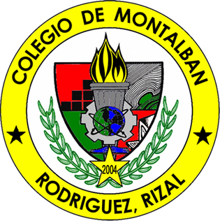

  

# eLibrary CDM

_A modern scholarly e-library platform for searching and saving academic research papers._

 

**eLibrary CDM** is a full-stack web application that helps users search, discover, and save academic research papers. It uses the OpenAlex API to provide access to scholarly paper information, allowing users to explore research articles and manage their own collection of bookmarked papers through a simple and easy-to-use interface.

---

## Features

- **Search Papers** — Find academic research papers using data from OpenAlex.
- **Personal Bookmarks** — Save and remove papers from your personal reading list.
- **Secure Authentication** — User accounts are protected with JWT authentication.
- **Responsive UI** — Works across desktop and mobile devices with a clean user interface.

---

## Tech Stack

### Frontend

- **Framework:** Next.js (React)
- **Styling:** Tailwind CSS
- **State & Data:** React Query, Axios
- **Validation:** Zod
- **Icons:** React Icons

### Backend

- **Framework:** Spring Boot (Java)
- **Database:** PostgreSQL
- **ORM:** Spring Data JPA / Hibernate
- **Security:** Spring Security & JWT Authentication
- **Caching:** Caffeine Cache & Bucket4j

---

  Built as a personal project for learning and practice.

